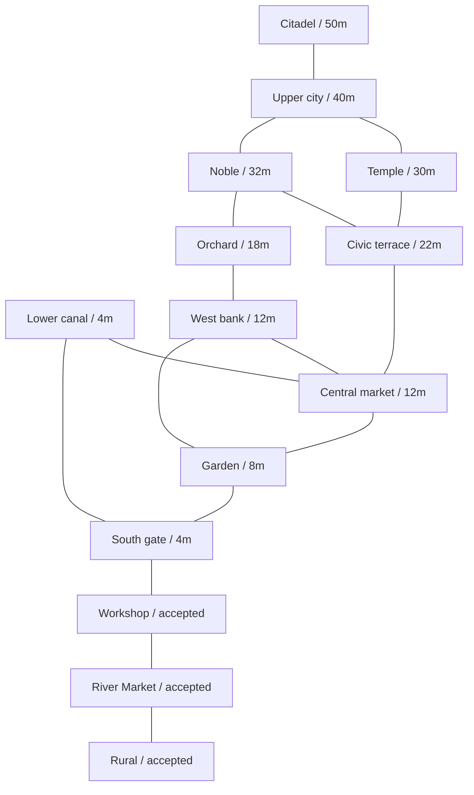

# M6 city blueprint

The master reference was actually opened from [city-master.png](reference/city-master.png). This interpretation establishes a walkable macro layout before production buildings. [city-blueprint.ts](../src/simulation/city-blueprint.ts) contains deterministic plain data in meters; [city-contracts.ts](../src/simulation/city-contracts.ts) defines the serializable district, road, water and camera contracts. No reference pixels enter shipped materials or assets.

## Observed evidence and design assumptions

The image visibly places the largest castle/citadel group on a broad high platform near the top of the portrait. Its pale forecourt, perimeter towers, orange roofs and selective teal caps make it the strongest landmark. Broad stairs descend toward the central city. Several lower platforms and retaining edges provide a clear elevation hierarchy, rather than one flat city floor. The lower half contains closely grouped roofs and towers beside repeated substantial bridges. Public spaces appear beside gateways, tower precincts and the upper forecourt. Planting occupies irregular margins, bank joints and courts; small cultivated plots and quieter detached structures sit at the edges. Water snakes through successive bridge openings and neighborhoods instead of following a single straight canal. Tall secondary towers recur along that route, but remain subordinate to the castle.

The image does **not** establish a compass direction, physical dimensions, exact terrace levels, hydraulic gradient, unseen facade/door positions or a complete road graph. Apparent upstream/downstream direction cannot be proven from the still image. The named districts, their boundaries, lanes, plazas and ramps are necessary design assumptions. One meter per unit and the accepted 1.75 m player set the scale. The macro envelope is 620 m wide by 708 m long: x −160..460 and z −660..48. North is −Z. The castle forecourt is 50 m above the world origin. These numbers were authored for traversal and readable composition, not recovered from pixel ratios.

The accepted rural slice, River Market and workshop forecourt retain their exact coordinates and authored courses. The new city grows north from these southern anchors. Their existing primary lane remains at y=4 m; the original river bridges, quays, stairs, crops, buildings, NPCs and asset IDs are unchanged. `accepted.*` roads describe topology and deliberately produce no replacement road surfaces. The new gate road joins the proven workshop lane at (206,4,−10).

## District graph

Each district stores its actual footprint polygon, center, elevation band, reciprocal neighbors, connection IDs, water adjacency, landmark IDs, density and streaming priority. Lower priority numbers favor the known starting content; they are authoring hints, not a requirement to load every higher tier. Elevation bands include their approach transitions; the terrace top is the district center's Y value. Named connection records provide both entrance/exit points and the corresponding road ID.

| Stable ID | Role / density | Terrace / approach band, m | Approximate footprint, m (x; z) | Neighbors | Water / landmark |
| --- | --- | --- | --- | --- | --- |
| `rural` | Accepted cottage/crops / rural | 4 / 0–8 | −48..48; −48..48 | River Market | Accepted river; original cottage/bridge |
| `river-market` | Accepted market, workshops/quays / dense | 4 / 0–5.4 | 48..146; −48..48 | Rural, workshop forecourt | Accepted river; original civic guild |
| `neighbor-shell` | Accepted workshop handoff / sparse | 4 / 4 | 146..218; −48..1 | River Market, south gate | Original workshop shell |
| `south-gate` | Entrance and bridge approaches / sparse | 4 / 0–4 | 218..380; −80..48 | Workshop, garden, lower canal | Southern reach; gate tower |
| `lower-canal` | Working river neighborhoods / medium | 4 / 0–4 | 290..460; −260..−80 | South gate, central market | Southern/middle reaches |
| `garden-terrace` | Planted transition / sparse | 8 / 4–8 | −80..218; −160..−48 | South gate, central market, west bank | No new water branch |
| `central-market` | Exchange plaza and dense street walls / dense | 12 / 8–12 | 0..240; −305..−160 | Garden, west bank, lower canal, civic | Middle reach; market belfry |
| `west-bank` | Courts and quieter homes / medium | 12 / 8–12 | −160..0; −365..−160 | Garden, market, orchard | West-bank tower |
| `civic-terrace` | Hall, public square, high bridge / dense | 22 / 12–22 | 0..210; −425..−305 | Market, noble, temple | Upper reach; civic hall |
| `noble-quarter` | Larger upper courts / medium | 32 / 22–32 | −70..110; −525..−425 | Civic, orchard, upper city | No new water branch |
| `temple-quarter` | Temple/academy tower precinct / monumental | 30 / 22–30 | 265..445; −495..−280 | Civic, upper city | Upper/headwater reaches; temple tower |
| `upper-city` | Dense streets below castle / dense | 40 / 30–40 | 110..280; −570..−425 | Noble, temple, citadel | Headwater reach |
| `citadel` | Dominant castle with clear forecourt / monumental | 50 / 40–50 | 40..280; −660..−570 | Upper city | Keep, high tower, wing |
| `orchard-edge` | Quiet western cultivation / rural | 18 / 12–18 | −160..−70; −660..−365 | West bank, noble quarter | No new water branch |

Bounds above describe polygons approximately; they are not rectangular district colliders. The 14 roles deliberately avoid arbitrary grid chunks. The western garden road and orchard route provide alternatives to the main spine; two high crossings connect the east precinct back to the upper approach. Most street loops return to a primary route. The short garden stair branch is a deliberate edge access rather than an additional city expansion.

## Terrain, river and circulation

Terrace tops are irregular convex polygons. Convex half-plane subtraction removes buffered road corridors, water strips and joint envelopes, producing stable triangle fragments. Those exact triangles are aggregated into **one static Surface/trimesh per new district, 11 grouped terrain proxies total**, rather than one collider per authoring fragment. Vertex positions, index winding, holes and support shape are preserved by the grouping. Accepted footprints receive no new terrace surfaces. This avoids a flat support slab crossing the river or blocking the uphill roads. The renderer derives retaining faces from the same terrain boundaries; a resident collision mesh closes those sides. Collision and visual roads share `cityRoadSurfaces`, including inclined quads, turn joins and short level ramp landings. Flat top surfaces and simple retaining masses remain a blockout limitation. Final bank erosion, natural slopes, retaining architecture and cliff material detail are later work.

The mean water level is **−1.16 m**, verified directly from the existing rural and district renderer source. The accepted market canal spans x48..146, z12..26; rural water is wider, with its original variable banks and plane retained. The blueprint's connecting centerline leaves (146,−1.16,19), continues east beyond the accepted workshop shell and bends north. The middle reach then moves west through (225,−1.16,−225) and (155,−1.16,−280), before returning east to (210,−1.16,−340). The upper reach passes (235,−1.16,−425) and (280,−1.16,−475); the inferred northern inlet ends at (310,−1.16,−630).

Every reach shares exact endpoint coordinates and a stable named endpoint. All remain at the accepted datum. A deeply incised river valley therefore runs below the high terraces. This hydraulic continuity is coherent but the resulting tall embankments are a design assumption, not evidence that the artwork has 50 m cliff walls. The north inlet and the eastward continuation of the accepted straight canal are explicitly inferred. The master supports the meandering main channel and repeated crossings; no invented decorative tributaries were added.

The graph has 26 road records, including the three accepted descriptive routes, and 17 district connections. New primary connections use 5.5–7 m widths, secondary streets 3.5–4 m, and alleys 2.6–2.8 m. Existing lane widths remain accepted. Every generated inclined road triangle is at or below a 1:5 grade. Ramp joins include level landings up to 5 m long so a branch does not begin above the controller's step limit. Four connection roads include crossings: the lower gate bridge, the exchange bridge, the civic high bridge and the northern high bridge. Bridge-class roads also include their approaches; parapets/piers are clipped to five actual river-crossing spans. Their high decks cross the river valley at readable heights rather than raising the water. The garden stair-class route uses a safe smooth collision slope with 24 visible treads no higher than 0.17 m. No jump is required by the representative route or the separately tested 17 connection routes.

The route starts at natural rural spawn, follows the proven cottage-front route through River Market and the workshop handoff, then enters south gate → garden terrace → central market → civic terrace → temple quarter → upper city → citadel. It rises from 4 to 50 m and crosses both upper bridges. Simulation tests use ordinary controller input throughout, with gradual waypoint approach, no teleport or jump. First-person and third-person use the same Rapier world and player state. Browser evidence is recorded separately by the parent integration; the simulation test is not a streaming cadence or production-performance claim.

## Landmark hierarchy, massing and cameras

Eight simple resident landmark masses establish orientation: three castle volumes, civic hall, temple tower, market belfry, south gate tower and west-bank tower. Before roof caps, the high castle tower reaches 92 m world height; the keep reaches 84 m and the wing 73 m. The temple tower reaches 58 m. Warm hipped roofs and selective teal octagonal caps/finials establish the reference's color hierarchy. Closed door marks are 1.1×2.2 m on front and rear elevations. These values create a dominant northern silhouette from many districts, while keeping a clear forecourt at the route endpoint. They are complete massing volumes rather than camera-facing facades, and contain no finished interiors or assets.

Representative blocks use authored nonuniform footprints and heights. Dense wards use aggregate 18–28 m footprints, broadly 14–19 m tall; quieter margins retain smaller lower masses. There are 62 admitted bodies and 62 cheap roof boxes, 124 massing instances total. Candidate blocks are rejected if their footprints meet roads, water, landmarks, district boundaries or another admitted block. This is a limited density/street-wall study, not hundreds of detailed buildings or a city NPC expansion. Upper civic/market density and skyline remain deliberately simpler than the reference.

The deterministic portrait master camera is southwest of the city at (−250,950,900), looking at (120,18,−300), FOV50°. It is an art/debug camera. The district map, castle-to-lower-city and water-network cameras complement four local debug cameras for market, civic, temple and citadel. Exact perspective/projection matching is uncertain from the source still image. Gameplay remains human-scale third-person with the same-world first-person option.

## Streaming ownership and verification

The parent `createCityWorld` adapter anchors the three accepted courses verbatim and maps all 14 IDs to the proven M5.1 lifecycle. Player, cameras, environment, lightweight terrain/roads/water and major landmark topology remain resident. Additional detail leases own only district massing; new districts add no NPCs or runtime assets. Adjacency limits preload choices to the nearest district and one connected, velocity-directed neighbor. A 2 m portal clearance retains the outgoing neighbor until the player clears its guard. Districts excluded from route demand deactivate and unload after a continuous 1.5 s graph departure; reversing demand resets that timer. This prevents an outgoing lease monopolizing a close city fork. M5.1's measured spatial retirement policy is unchanged on its original corridor. The existing two-lease admission, incremental preparation, cancellation, resource accounting, compile/warmup and activation rules remain authoritative. The overview can show lightweight massing for visual review; that diagnostic display does not activate all detail leases or expand NPC residency. Proxy timings cannot predict a finished city's performance.

Focused [city.spec.ts](../tests/city.spec.ts) checks stable JSON round-trip data, exact district ID coverage, reciprocal connected graph, connection road references, accepted footprint anchoring, source-derived water continuity, widths/slopes, road clearances, terrain corridor exclusion, massing floor support and continuous Rapier traversal in both gameplay modes. Final browser routes, captured views, M5.1 regression checks and qualitative comparison are reported by the parent in STATUS/reference review. No screenshot, hosted CI result, performance number or owner acceptance is inferred from these data tests.

The actual final master, labeled map and paired street captures were opened for review. Three largest observed macro differences remain: the meter-authored layout is broader and more open than the compressed portrait, with fewer/larger roof clusters and broad courts; the single-datum river creates deep valleys with long plain retaining walls instead of closely interlocked bank/bridge architecture; and the citadel's three-volume silhouette and sparse perimeter simplify the reference's many towers and layered forecourt. These are qualitative review findings, not a numerical fidelity score. Exact captures, conditions and measurements are linked from STATUS.md and `reference/REVIEWS.md`. Stop at the M6 human-review gate.
