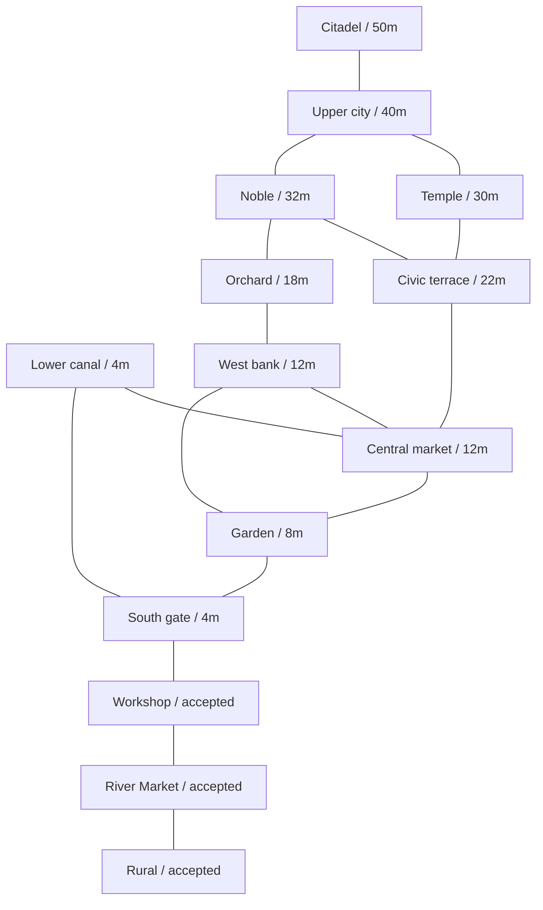

# M6.1 city blueprint

## M7 production overlay

M7 uses the merged M6.1 topology below without replacing its macro layout. Only Central Market and Lower Canal receive production detail. Their original macro terrain, roads, waterways, connection records and district footprints remain unchanged and are checked by data equality. M7 suppresses the original market-belfry presentation/collider while its deliberate six-story tower occupies the same (158,12,-260) anchor. Small local support joints, service alleys and a connected Lower Canal cargo dock append to the detail courses. The other city districts retain their M6.1 proxy status. This does not authorize M8 or productionizing the remaining districts; owner review of the M7 evidence remains the gate.

The master reference was actually opened from [city-master.png](reference/city-master.png). This interpretation establishes a walkable macro layout before production buildings. [city-blueprint.ts](../src/simulation/city-blueprint.ts) contains deterministic plain data in meters; [city-contracts.ts](../src/simulation/city-contracts.ts) defines the serializable district, road, water and camera contracts. No reference pixels enter shipped materials or assets.

## Observed evidence and design assumptions

The image visibly places the largest castle/citadel group on a broad high platform near the top of the portrait. Its pale forecourt, perimeter towers, orange roofs and selective teal caps make it the strongest landmark. Broad stairs descend toward the central city. Several lower platforms and retaining edges provide a clear elevation hierarchy, rather than one flat city floor. The lower half contains closely grouped roofs and towers beside repeated substantial bridges. Public spaces appear beside gateways, tower precincts and the upper forecourt. Planting occupies irregular margins, bank joints and courts; small cultivated plots and quieter detached structures sit at the edges. Water snakes through successive bridge openings and neighborhoods instead of following a single straight canal. Tall secondary towers recur along that route, but remain subordinate to the castle.

The image does **not** establish a compass direction, physical dimensions, exact terrace levels, hydraulic gradient, unseen facade/door positions or a complete road graph. Apparent upstream/downstream direction cannot be proven from the still image. The named districts, their boundaries, lanes, plazas and ramps are necessary design assumptions. One meter per unit and the accepted 1.75 m player set the scale. M6.1 narrows the macro envelope from 620 to **545 m** while retaining its 708 m length: x −160..385 and z −660..48. North is −Z. The castle forecourt remains at 50 m. The origin and accepted areas stay fixed; this is an authored layout compression, not a global rescale or a measurement from pixels. The bounded convergence objective is [M6.1](prompts/06-1-city-convergence.md); original M6 findings and timings remain in [historical STATUS](history/M6_STATUS.md).

The accepted rural slice, River Market and workshop forecourt retain their exact coordinates and authored courses. The new city grows north from these southern anchors. Their existing primary lane remains at y=4 m; the original river bridges, quays, stairs, crops, buildings, NPCs and asset IDs are unchanged. `accepted.*` roads describe topology and deliberately produce no replacement road surfaces. The new gate road joins the proven workshop lane at (206,4,−10).

## District graph

Each district stores its actual footprint polygon, center, elevation band, reciprocal neighbors, connection IDs, water adjacency, landmark IDs, density and streaming priority. Lower priority numbers favor the known starting content; they are authoring hints, not a requirement to load every higher tier. The main terrace top is the center's Y value; bands include intermediate levels and approaches. Named connection records provide both entrance/exit points and the road ID. All **14 district IDs and 17 unique adjacency edges** survive M6.1 unchanged. Four secondary portals reuse existing neighbor pairs, giving 21 gated connections rather than new graph edges.

| Stable ID | Role / density | Terrace / approach band, m | Approximate footprint, m (x; z) | Neighbors | Water / landmark |
| --- | --- | --- | --- | --- | --- |
| `rural` | Accepted cottage/crops / rural | 4 / 0–8 | −48..48; −48..48 | River Market | Accepted river; original cottage/bridge |
| `river-market` | Accepted market, workshops/quays / dense | 4 / 0–5.4 | 48..146; −48..48 | Rural, workshop forecourt | Accepted river; original civic guild |
| `neighbor-shell` | Accepted workshop handoff / sparse | 4 / 4 | 146..218; −48..1 | River Market, south gate | Original workshop shell |
| `south-gate` | Entrance and bridge approaches / sparse | 4 / 0–4 | 218..380; −80..48 | Workshop, garden, lower canal | Southern reach; gate tower |
| `lower-canal` | Working river neighborhoods / medium | 4 / 0–8 | 225..385; −260..−80 | South gate, central market | Southern/middle reaches; inhabited quay |
| `garden-terrace` | Planted transition / sparse | 8 / 4–8 | −80..225; −160..−48 | South gate, central market, west bank | No new water branch |
| `central-market` | Exchange plaza and dense street walls / dense | 12 / 8–12 | 0..225; −305..−160 | Garden, west bank, lower canal, civic | Middle reach; market belfry |
| `west-bank` | Courts and quieter homes / medium | 12 / 8–12 | −160..0; −365..−160 | Garden, market, orchard | West-bank tower |
| `civic-terrace` | Hall, stair quarters, high bridge / dense | 22 / 12–22 | −70..225; −425..−305 | Market, noble, temple | Upper reach; hall, embedded gate, buttresses |
| `noble-quarter` | Larger upper courts / medium | 32 / 22–36 | −70..110; −570..−425 | Civic, orchard, upper city | 36 m stair quarter |
| `temple-quarter` | Temple/academy and bank terraces / monumental | 30 / 18–30 | 225..380; −495..−260 | Civic, upper city | Upper/headwater reaches; temple tower |
| `upper-city` | Dense streets below castle / dense | 40 / 30–40 | 110..250; −570..−425 | Noble, temple, citadel | Headwater reach; three support masses |
| `citadel` | Layered castle, gate and forecourt / monumental | 50 / 40–50 | 40..280; −660..−570 | Upper city | Six towers, keep, courts, walls, gate piers |
| `orchard-edge` | Quiet western cultivation / rural | 18 / 12–18 | −160..−70; −660..−365 | West bank, noble quarter | No new water branch |

Bounds above describe polygons approximately; they are not rectangular district colliders. The 14 roles deliberately avoid arbitrary grid chunks. The western garden road and orchard route provide alternatives to the main spine; two high crossings connect the east precinct back to the upper approach. Most street loops return to a primary route. The short garden stair branch is a deliberate edge access rather than an additional city expansion.

## Terrain, river and circulation

M6.1 joins the central market to civic, extends civic into its former western void, carries noble north to the citadel boundary, and brings temple/lower canal west toward the shared water corridor. Seven intermediate terraces replace selected dead edges: the 20 m western retaining quarter, 18 m civic stair quarter, 8 m inhabited quay, 22 m east-bank street, 18 m bank garden, 36 m noble stair quarter and 44 m citadel gate terrace. Each has a named tested access road and existing district owner; no isolated decorative terrace is introduced. Together with main tops, authored terrain uses twelve levels: 4, 8, 12, 18, 20, 22, 30, 32, 36, 40, 44 and 50 m. The 38 m northern bridge approach is a roadway transition, not another terrain tier.

Convex half-plane subtraction clips buffered road/water corridors and intermediate terraces from their owner polygons. Exact triangles aggregate into **18 grouped terrain surfaces: eleven main district tops and seven intermediate terraces**, rather than one collider per fragment. Accepted footprints receive no new surfaces. Both renderer and Rapier use `cityRetainingSurface`: exposed sides end at the actual neighboring terrace/street floor, coplanar seams disappear, and supported internal joins do not descend unnecessarily to the valley base. Civic buttresses, the embedded gate, secondary stair cuts and the citadel gate/perimeter masses break selected long runs structurally. Collision and visual roads share `cityRoadSurfaces`, including inclined decks, turn joins and short level landings. Some long canal faces and plain flat tops remain visible; final bank/retaining art is outside M6.1.

The mean water level remains **−1.16 m**, verified from the accepted rural and district renderer source. Their canal/banks are unchanged. The connecting centerline leaves (146,−1.16,19), bends north to (260,−1.16,−175), runs through (205,−1.16,−225), (165,−1.16,−280), (210,−1.16,−340), (220,−1.16,−425), (245,−1.16,−475), then reaches the inferred inlet at (285,−1.16,−630). Middle/upper/headwater widths shrink from 18/16/14 m to **12 m**; the accepted and southern 14 m widths remain. This tightens dense district separation while retaining five continuous endpoint-connected reaches.

Every reach shares exact endpoint coordinates and a stable named endpoint. All remain at the accepted datum. A deeply incised river valley therefore runs below the high terraces. This hydraulic continuity is coherent but the resulting tall embankments are a design assumption, not evidence that the artwork has 50 m cliff walls. The north inlet and the eastward continuation of the accepted straight canal are explicitly inferred. The master supports the meandering main channel and repeated crossings; no invented decorative tributaries were added.

There are **37 road records**, including two accepted descriptive lanes, and **21 gated connections** over the unchanged 17 neighbor pairs. Eleven new records add retaining streets, stair quarters, market/civic lanes, a quay bridge lane and an upper gate plaza. Four secondary portals parallel central/lower, civic/noble, noble/upper and central/civic links. Primary widths are generally 5.5–6.5 m; the monumental citadel ascent widens to 9 m. Secondary lanes are 3.5–4.2 m, alleys 2.6–2.8 m, and new stairs 3.8 m. Existing lane widths remain accepted. All actual inclined road triangles stay at or below a 1:5 grade; joins have level landings up to 5 m. Five bridge-class records include approaches; rails/piers are clipped to **seven actual water-crossing spans**, including two short crossings on the quay lane. **406 visible treads** have rises at or below 0.17 m over smooth controller support. All 37 authored paths are traversed separately in both modes, with one explicit setup reset per isolated path and no recovery during its legs. The continuous spine needs no jump, setup teleport or recovery.

The route starts at natural rural spawn, follows the proven cottage-front route through River Market and the workshop handoff, then enters south gate → garden terrace → central market → civic terrace → temple quarter → upper city → citadel. It rises from 4 to 50 m and crosses both upper bridges. Simulation tests use ordinary controller input throughout, with gradual waypoint approach, no teleport or jump. First-person and third-person use the same Rapier world and player state. Browser evidence is recorded separately by the parent integration; the simulation test is not a streaming cadence or production-performance claim.

## Landmark hierarchy, massing and cameras

**Thirty resident landmark/structural bodies** establish the expanded hierarchy. The citadel has six towers, the keep, staggered courtyard wings, five perimeter wall masses and two piers around a 44 m gate terrace. Three upper-city support buildings sit below it. The civic hall gains four buttresses and an embedded gate. The highest tower body reaches 92 m before its teal cap; keep 84 m, wing 73 m, temple tower 58 m. Warm hipped roofs and selective octagonal caps establish skyline hierarchy; structural walls, buttresses and piers remain uncapped. Lower-market gameplay and the elevated lower-city composition camera show the castle roofline over its supporting city. Full fronts/backs and closed entrance marks remain simple proxy geometry, without final citadel assets or interiors.

Representative blocks use authored nonuniform footprints and heights, including narrower connector and street-wall groups. **88 admitted bodies and 88 roof boxes** give 176 massing instances, up from 62 bodies in M6. Full corner/polygon/corridor checks reject unsupported or overlapping candidates, including terrace-level changes. These remain aggregate density studies with coarse roof grain and broad courts; no production building generator, detailed city assets or city-wide NPC expansion is introduced.

The deterministic portrait master camera is southwest of the city at (−250,950,900), looking at (120,18,−300), FOV50°. It is an art/debug camera. The district map, castle-to-lower-city and water-network cameras complement four local debug cameras for market, civic, temple and citadel. Exact perspective/projection matching is uncertain from the source still image. Gameplay remains human-scale third-person with the same-world first-person option.

## Streaming ownership and verification

The parent `createCityWorld` adapter anchors the three accepted courses verbatim and maps all 14 IDs to the proven M5.1 lifecycle. Player, cameras, environment, lightweight terrain/roads/water and major landmark topology remain resident. Additional detail leases own only district massing; new districts add no NPCs or runtime assets. Adjacency limits preload choices to the nearest district and one connected, velocity-directed neighbor. A 2 m portal clearance retains the outgoing neighbor until the player clears its guard. Districts excluded from route demand deactivate and unload after a continuous 1.5 s graph departure; reversing demand resets that timer. This prevents an outgoing lease monopolizing a close city fork. M5.1's measured spatial retirement policy is unchanged on its original corridor. The existing two-lease admission, incremental preparation, cancellation, resource accounting, compile/warmup and activation rules remain authoritative. The overview can show lightweight massing for visual review; that diagnostic display does not activate all detail leases or expand NPC residency. Proxy timings cannot predict a finished city's performance.

Focused [city.spec.ts](../tests/city.spec.ts) checks stable JSON round-trip data, exact district ID coverage, reciprocal connected graph, connection road references, accepted footprint anchoring, source-derived water continuity, widths/slopes, road clearances, terrain corridor exclusion, massing floor support and continuous Rapier traversal in both gameplay modes. Final browser routes, captured views, M5.1 regression checks and qualitative comparison are reported by the parent in STATUS/reference review. No screenshot, hosted CI result, performance number or owner acceptance is inferred from these data tests.

The new eagle-eye was opened directly beside the original master and preserved M6 view, with an unchanged canonical camera. Three largest macro differences remain: aggregate roof clusters and broad courts leave a coarser, more open urban grain; the single-datum water still creates deep incised retaining faces with less interlocked bank/bridge architecture; and the citadel/upper city retain broad rectilinear platforms and simpler asymmetric layering than the master. Exact captures, conditions, tests and qualitative review are linked from STATUS and `reference/REVIEWS.md`. **Stop at the M6.1 human-review gate. M7 has not begun.**
