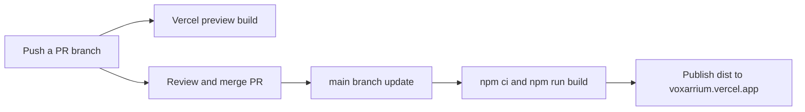

# Vercel deployment

The owner authorized deployment and automatic updates from merged PRs on 2026-10-04. The Vercel project `voxarrium` belongs to `adrian-darians-projects` on the existing Hobby plan and is linked directly to `adriandarian/Voxarrium` on GitHub. Its production branch is `main`.

## Live links

- [Current M8 city core](https://voxarrium.vercel.app/?scene=m8)
- [Explicit WebGL2 city core](https://voxarrium.vercel.app/?scene=m8&backend=webgl)
- [Default M5 comparison corridor](https://voxarrium.vercel.app/)
- [Vercel project dashboard](https://vercel.com/adrian-darians-projects/voxarrium)

Scene selection remains the runtime's existing query-string contract. The bare domain opens the older comparison corridor; use `?scene=m8` for the current connected core. HTTPS permits WebGPU on supported browsers and hardware; the runtime reports the backend that actually initializes.

## Automatic releases

Vercel's native Git integration handles deployments. Every update to `main`, including a merged PR, creates a production deployment. It also deploys direct pushes to `main`; merge-only enforcement would require a separate repository branch-protection decision. Other branches receive previews. A successful production build updates the stable domain; a failed build leaves the last successful production deployment in place. No additional GitHub Actions deployment workflow or deployment token is required.

The committed `vercel.json` declares Vite, `npm ci`, `npm run build`, and `dist`. The dashboard has the same build settings and Node.js `22.x`. The package engine range is bounded to `>=22.12.0 <23` because [Vercel's package engine setting overrides the dashboard](https://vercel.com/docs/functions/runtimes/node-js/node-js-versions); an unbounded minimum would select the newest supported major. Dependency versions and integrity records are unchanged.

The initial deployment used the existing `main` commit `efee826fb4002c5aacf1af43244edd129a0dd6f1`, before this configuration PR. Vercel reports deployment `dpl_EmRLcTy4qYmy1vmizP696XTZUgm7` as `READY`, target `production`, with `voxarrium.vercel.app` assigned and verified. The initial build used Vercel's detected settings; this PR makes future build settings explicit.

Pushing configuration commit `3ebca3ef1d55f5b79404d50bde0a404d076a47a3` to `chore/vercel-deployment` automatically created preview `dpl_DbLSLTSMYhAEaxsztC7ZXNARZwcJ`, reported `READY`. Its build logs confirm Node changed from 24.x to 22.x, `npm ci` ran, and the production build completed with the same emitted runtime asset names and sizes as the local build. GitHub's Vercel status is successful on [configuration PR #22](https://github.com/adriandarian/Voxarrium/pull/22). This verifies the live Git-triggered preview path; a future main merge has not been performed as a test.

The team's default deployment protection remains configured. Preview and deployment-specific URLs may request Vercel authentication. Local `.vercel/` linkage is ignored by Git. Reference PNGs remain under `docs/` and are excluded from the shipped `dist` output.

## Verification scope

Local verification for deployment preparation: `npm ci`, `npm run build`, `npm run check`, `npm run doctor`, `npm run references:verify`, `node --test tests/bootstrap.test.mjs` (12 passing checks), and `git diff --check`. The first build/typecheck attempts failed because this new worktree lacked installed dependencies; `npm ci` corrected that, and both commands passed afterward. The existing large-bundle advisory remains.

Hosted verification uses Vercel's deployment state, assigned production domain, source commit metadata, and build logs. This deployment task does not claim a hosted gameplay/GPU test, browser screenshot, new performance measurement, or rerun of the full simulation/browser suites. The previously recorded M8 suites remain historical evidence in `STATUS.md`.

Official guidance: [Git integration](https://vercel.com/docs/git) and [Vite on Vercel](https://vercel.com/docs/frameworks/frontend/vite).
